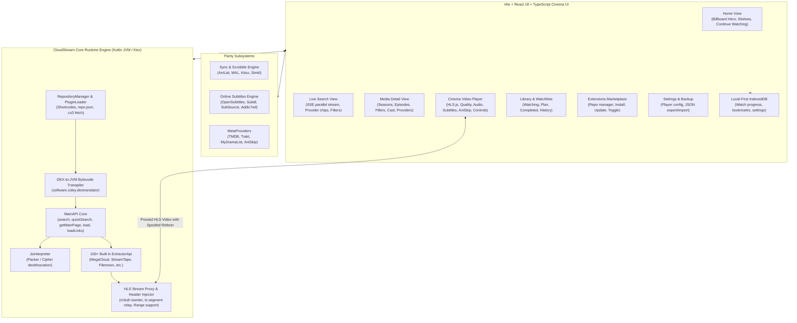

# Implementation Plan - CloudStream Web Edition (Full Parity Architecture)

A comprehensive, production-grade architectural blueprint to build the **CloudStream Web Edition** with complete feature parity to the CloudStream Android app ([`cloudstream`](file:///d:/Poject/CloudStream/cloudstream)), based on deep structural graph analysis ([`cloudstream/graphify-out`](file:///d:/Poject/CloudStream/cloudstream/graphify-out/GRAPH_REPORT.md)) and the Kotlin desktop engine ([`Windows desktop app`](file:///d:/Poject/CloudStream/Windows%20desktop%20app)).

---

## User Review Required

> [!IMPORTANT]
> **Zero Architectural Compromises for Full Parity**:
> To achieve 100% feature parity with Android CloudStream, the web edition requires:
> 1. **Kotlin Ktor Backend & Stream Proxy**: Reuses `software.coley.dextranslator` and `DesktopPluginLoader` to execute existing `.cs3` plugins directly without rewriting scrapers in JavaScript.
> 2. **HLS Playlist Rewriter & CORS Proxy**: Bypasses browser CORS and forbidden headers (`Referer`, `User-Agent`) by streaming `.m3u8` and `.ts` chunks through local/remote Ktor proxy routes.
> 3. **Full CloudStream Subsystems Ported to Web**:
>    - Multi-provider parallel search with Server-Sent Events (SSE) progressive streaming.
>    - Complete Cinema Player: adaptive bitrate (`hls.js`), audio track switching, external/embedded subtitle styling and timing sync, online subtitle search (OpenSubtitles, Subdl, SubSource, Addic7ed), AniSkip intro/outro skipping, aspect ratio modes, playback speed, and sleep timer.
>    - Metadata & Sync Services: AniList, MyAnimeList (MAL), Kitsu, and Simkl tracking and scrobbling.
>    - Plugin & Repo Marketplace: shortcode support (`cspr`, `megarepo`, `phisherrepo`, `csx`), dynamic repo management, one-click install/update/disable.
>    - Library & Local-First Persistence: IndexedDB storage for bookmarks, categorized watchlists (Watching, Plan to Watch, Completed, On Hold, Dropped), watch history, and full JSON backup/restore.

---

## Architectural Overview & Graphify Findings

From the 6,412 nodes and 15,458 edges analyzed in [`cloudstream/graphify-out/GRAPH_REPORT.md`](file:///d:/Poject/CloudStream/cloudstream/graphify-out/GRAPH_REPORT.md), the CloudStream ecosystem is powered by key core abstractions:



---

## Detailed System Component Specifications

### 1. Backend: Kotlin Ktor Headless Server & Proxy (`cloudstream-web/server`)

#### A. Plugin Engine & DEX-to-JVM Bytecode Transpilation
- **Port of `DesktopPluginLoader`**:
  Directly executes `.cs3` files downloaded from CloudStream repos. It intercepts `classes.dex` inside `.cs3` (JAR/ZIP) packages and transpiles Dalvik bytecode to JVM bytecode using `software.coley.dextranslator`:
  ```kotlin
  val dexBytes = jar.getInputStream(dexEntry).readBytes()
  val options = Options().setLenient(true).setReplaceInvalidMethodBodies(true)
  val appData = ApplicationData.fromDex(dexBytes, options)
  val translatedMap = appData.exportToJvmClassMap()
  val classLoader = DynamicMemoryClassLoader(translatedMap, parentClassLoader)
  val plugin = classLoader.loadClass(manifest.pluginClassName).getDeclaredConstructor().newInstance() as BasePlugin
  plugin.load(fakeContext)
  ```
- **Built-in `JsInterpreter`**: Includes the tree-walk JS evaluator from `com.lagradost.cloudstream3.extractors.helper.JsInterpreter` so provider decryption ciphers execute without external node dependencies.
- **Repository Shortcode Resolution**:
  - `cspr` / `0094`: CloudStream Official Provider Repo
  - `megarepo` / `3737`: MegaRepo
  - `phisherrepo` / `864`: Phisher's Extension Repo
  - `csx` / `3670`: CSX Repo
  - Custom URLs: Direct `repo.json` endpoints (including Nehal's Server).

#### B. REST Endpoints & Progressive SSE Streaming
| Endpoint | Method | Description |
|---|---|---|
| `/api/home?api=<name>&page=<n>` | GET | Returns dynamic catalog rows (`HomePageList` / `HomePageResponse`) |
| `/api/search?q=<query>&apis=<list>` | GET | Parallel multi-provider search streaming results over Server-Sent Events (SSE) |
| `/api/quicksearch?q=<query>` | GET | Fast title suggestion query for search bar autocomplete |
| `/api/load?api=<name>&url=<url>` | GET | Fetches full media metadata (`LoadResponse`, seasons, episodes, cast, recommendations) |
| `/api/loadLinks?api=<name>&data=<data>` | GET | Runs extractors and returns direct/proxied stream links, audio tracks, and subtitles |
| `/api/proxy/m3u8?url=<url>&sessionId=<id>` | GET | Rewrites upstream `.m3u8` playlists with custom `Referer` and proxy segment URLs |
| `/api/proxy/segment?url=<url>&sessionId=<id>` | GET | Relays `.ts` or `.m4s` video segments with spoofed headers and HTTP Range support |
| `/api/plugins/list` | GET | Lists all installed and available plugins across added repositories |
| `/api/plugins/install` | POST | Downloads, translates, and enables a `.cs3` plugin |
| `/api/plugins/toggle` | POST | Enables or disables an installed plugin |
| `/api/plugins/uninstall` | POST | Removes a plugin from the system |
| `/api/repos` | GET/POST/DELETE | Manages repository URLs and shortcodes |
| `/api/subtitles/search?title=<t>&season=<s>&ep=<e>` | GET | Queries OpenSubtitles, Subdl, SubSource, and Addic7ed |
| `/api/meta/aniskip?malId=<id>&episode=<e>` | GET | Fetches intro/outro timestamps from AniSkip API |
| `/api/sync/mal|anilist|kitsu|simkl` | GET/POST | Manages OAuth authorization tokens and watch scrobbling |

#### C. HLS Playlist & Chunk Proxy Engine
- **Master & Variant Playlist Rewriter**:
  - Automatically detects `#EXT-X-STREAM-INF` resolutions (1080p, 720p, etc.) and preserves bandwidth metadata.
  - Rewrites child playlist URLs to pass through `/api/proxy/m3u8`.
- **Media Chunk Rewriter**:
  - Rewrites all media segment URIs (`.ts`, `.m4s`, `.mp4`) to `/api/proxy/segment?url=<absoluteUrl>&sessionId=<id>`.
  - Spoofs `Referer`, `User-Agent`, `Origin`, and required cookies on upstream calls.
  - Passes client HTTP `Range: bytes=X-Y` headers to upstream servers for instantaneous seeking.
  - Injects `Access-Control-Allow-Origin: *` and `Access-Control-Expose-Headers: Content-Length, Content-Range`.

---

### 2. Frontend: Dark Cinema Web Application (`cloudstream-web/web`)

#### A. Screen Workflows & Pages
1. **Home Page (`/`)**:
   - **Hero Billboard Banner**: High-resolution backdrop art, animated title, genre tags, plot preview, "Play Now" and "Details" buttons.
   - **Continue Watching Row**: Shows in-progress movies/episodes with precise visual progress bars and one-click resume.
   - **Dynamic Provider Shelves**: Horizontal carousels with drag/touch scrolling for Trending, Popular, Top Rated, and Anime.
   - **Active Provider Selector**: Quick dropdown to switch homepage content between installed providers.

2. **Search & Discovery (`/search`)**:
   - **Progressive Results Feed**: Results stream in via SSE as each provider finishes. Cards appear immediately without waiting for the slowest provider.
   - **Provider Status Chips**: Interactive chips displaying provider search status and hit counts (`[NetMirror: 14] [VegaMovies: 9] [Aniwatch: 21]`).
   - **Type & Genre Filter Bar**: Filter by `Movie`, `TvSeries`, `Anime`, `AsianDrama`, `Cartoon`, or genres.
   - **Search History**: Recent searches saved in IndexedDB with quick-fill chips.

3. **Media Details (`/details`)**:
   - **Hero Backdrop**: Immersive blurred/gradient backdrop banner with poster art, ratings, release year, duration, and status (Ongoing / Completed).
   - **Watch Status Picker**: Dropdown for "Watching", "Plan to Watch", "Completed", "On Hold", "Dropped".
   - **Season & Episode Browser**:
     - Clean season tabs (`Season 1`, `Season 2`, `Specials`).
     - Episode grid / list with episode thumbnails, air dates, titles, and plot descriptions.
     - **Filler Episode Badges**: Displays anime filler indicators (`FillerEpisodeCheck`).
     - Visual progress bar on each watched episode.
   - **Provider Selector**: Switch between different providers for the same title (e.g. compare NetMirror vs VegaMovies).
   - **Cast & Crew**: Horizontal scroll of actor avatars and character names.
   - **Trailer Modal**: Integrated YouTube trailer player.
   - **More Like This**: Recommended titles shelf.

4. **Cinema Video Player (`/player`)**:
   - **Player Core**: Powered by `hls.js` with adaptive bitrate streaming (ABR).
   - **Server / Extractor Switcher**: Seamlessly switch between streaming sources (Server 1, Server 2) with auto-failover on dead links.
   - **Quality Selector**: Auto, 1080p, 720p, 480p, 360p.
   - **Multi-Audio Track Selector**: Switch between audio languages (English, Japanese, Dual Audio, etc.).
   - **Subtitle Engine**:
     - Embedded and external subtitles (VTT, SRT).
     - **In-Player Online Subtitle Search**: Search and load subtitles on the fly from OpenSubtitles, Subdl, SubSource, and Addic7ed.
     - **Custom Subtitle Styling**: Font size (80% - 150%), font color, background contrast box opacity, text outline, and timing offset adjustment (-5.0s to +5.0s).
   - **AniSkip Integration**:
     - Fetches anime opening/ending timestamps from AniSkip.
     - Interactive "Skip Intro" (OP) and "Skip Outro" (ED) overlay buttons with auto-skip option.
   - **Player Controls & Ergonomics**:
     - Aspect ratio modes: Normal (Fit), Stretch, Zoom (16:9, 21:9 crop).
     - Playback speed: 0.5x, 0.75x, 1.0x, 1.25x, 1.5x, 2.0x.
     - Sleep timer: 15m, 30m, 60m, or end of episode.
     - Picture-in-Picture (PiP) and Fullscreen toggle.
     - Auto-play next episode countdown popup (`< 30s` remaining).
     - Next / Previous episode navigation.
     - Full keyboard shortcuts (`Space`/`K`, arrows, `F`, `M`, `C`, `S`, `N`, `P`).

5. **Library & Watchlist (`/library`)**:
   - Tabbed view: **Continue Watching**, **Watchlist** (Watching, Plan to Watch, Completed, On Hold, Dropped), and **Full Watch History**.
   - Mark as watched / unwatched toggles.
   - Batch management and history clearing.

6. **Plugins & Repository Marketplace (`/plugins`)**:
   - **Repository Manager**: Add repository URLs or shortcodes (`cspr`, `megarepo`, etc.).
   - **Plugin Catalog**: Browse available providers with language filters, category tags, and version details.
   - One-click Install, Update, Toggle Enable/Disable, and Uninstall.

7. **Settings & Sync (`/settings`)**:
   - **Sync Accounts**: Connect AniList, MyAnimeList, Kitsu, and Simkl accounts for automatic scrobbling.
   - **Player Defaults**: Default resolution, auto-play next episode, auto-skip intro, preferred subtitle language.
   - **Backup & Restore**: One-click JSON export/import of watch progress, history, bookmarks, settings, and repo sources.

---

## File and Component Structure

```text
d:/Poject/CloudStream/cloudstream-web/
├── server/                                  # Kotlin Ktor Headless Server & Proxy
│   ├── build.gradle.kts                     # Ktor, software.coley.dextranslator, OkHttp, Coroutines
│   ├── src/main/kotlin/com/lagradost/cloudstream/server/
│   │   ├── Application.kt                   # Ktor server entrypoint, CORS, ContentNegotiation
│   │   ├── plugins/
│   │   │   ├── ServerPluginLoader.kt        # Port of DesktopPluginLoader (DEX transpilation)
│   │   │   ├── RepoManager.kt               # Shortcode resolver & repo.json sync
│   │   │   └── FakeContext.kt               # Headless Android Context shim
│   │   ├── proxy/
│   │   │   ├── StreamProxyRoute.kt          # /api/proxy/m3u8 & /api/proxy/segment
│   │   │   ├── HlsPlaylistRewriter.kt       # m3u8 playlist parser & URL rewriter
│   │   │   └── SubtitleProxyRoute.kt        # Subtitle fetch & SRT-to-VTT converter
│   │   ├── routes/
│   │   │   ├── CatalogRoutes.kt             # /api/home & /api/quicksearch
│   │   │   ├── SearchRoutes.kt              # /api/search (SSE parallel coroutines)
│   │   │   ├── LoadRoutes.kt                # /api/load (metadata, seasons, episodes)
│   │   │   ├── LinksRoutes.kt               # /api/loadLinks (extractors -> stream URLs)
│   │   │   ├── PluginsRoutes.kt             # /api/plugins & /api/repos
│   │   │   ├── SubtitleRoutes.kt            # /api/subtitles/search (OpenSubtitles, etc.)
│   │   │   ├── MetaRoutes.kt                # /api/meta (AniSkip, TMDB enrichment)
│   │   │   └── SyncRoutes.kt                # /api/sync (AniList, MAL, Kitsu OAuth & scrobble)
│   │   └── models/
│   │       ├── DTOs.kt                      # Clean JSON models for Frontend consumption
│   │       └── ProxySession.kt              # In-memory proxy session store with headers
│   └── src/main/resources/
│       └── application.conf
│
├── web/                                     # Vite + React 18 + TypeScript Cinema Frontend
│   ├── package.json
│   ├── vite.config.ts
│   ├── index.html
│   ├── src/
│   │   ├── api/
│   │   │   ├── client.ts                    # Axios client instance
│   │   │   ├── catalogApi.ts                # Home shelves & quick search
│   │   │   ├── searchApi.ts                 # SSE progressive search stream handler
│   │   │   ├── mediaApi.ts                  # Load metadata & load links
│   │   │   ├── pluginsApi.ts                # Plugins & repo management
│   │   │   ├── subtitlesApi.ts              # Online subtitle search
│   │   │   └── syncApi.ts                   # AniList / MAL / Simkl sync
│   │   ├── components/
│   │   │   ├── layout/
│   │   │   │   ├── Navbar.tsx               # Top search bar, quicksearch dropdown, nav links
│   │   │   │   ├── Sidebar.tsx              # Cinema left sidebar (Home, Search, Library, Plugins, Settings)
│   │   │   │   └── MobileNav.tsx            # Bottom nav bar for mobile/touch viewports
│   │   │   ├── home/
│   │   │   │   ├── BillboardHero.tsx        # Top backdrop banner with trailer & play CTA
│   │   │   │   ├── ShelfCarousel.tsx        # Netflix-style drag/scroll media row
│   │   │   │   └── ContinueWatchingRow.tsx  # In-progress cards with progress bar
│   │   │   ├── search/
│   │   │   │   ├── SearchBar.tsx            # Input with debounce & clear
│   │   │   │   ├── ProviderChips.tsx        # Active provider progress & count chips
│   │   │   │   ├── SearchFilterBar.tsx      # Movies, Series, Anime, Genre chips
│   │   │   │   └── SearchResultsGrid.tsx    # Responsive grid of MediaCards
│   │   │   ├── details/
│   │   │   │   ├── MediaHero.tsx            # Backdrop, poster, synopsis, ratings
│   │   │   │   ├── WatchStatusSelector.tsx  # Watching, Plan to Watch, Completed dropdown
│   │   │   │   ├── SeasonEpisodePicker.tsx  # Season tabs + episode cards with filler badges
│   │   │   │   ├── ProviderSwitcher.tsx     # Switch stream provider for same media
│   │   │   │   ├── CastRow.tsx              # Actor avatars & names
│   │   │   │   └── TrailerModal.tsx         # YouTube trailer modal
│   │   │   ├── player/
│   │   │   │   ├── CinemaVideoPlayer.tsx    # Main player container with Hls.js
│   │   │   │   ├── PlayerControls.tsx       # Timeline, play/pause, volume, time display
│   │   │   │   ├── ServerMenu.tsx           # Extractor source selection & auto-failover
│   │   │   │   ├── QualityMenu.tsx          # Resolution picker (Auto, 1080p, 720p, etc.)
│   │   │   │   ├── AudioTrackMenu.tsx       # Multi-language audio track selector
│   │   │   │   ├── SubtitleOverlay.tsx      # Custom subtitle renderer with styling
│   │   │   │   ├── SubtitleModal.tsx        # Online subtitle search & timing offset sync
│   │   │   │   ├── AniSkipOverlay.tsx       # Skip Intro / Skip Outro buttons
│   │   │   │   ├── NextEpisodeCountdown.tsx # Auto-play next episode overlay
│   │   │   │   └── PlayerSettingsModal.tsx  # Speed, aspect ratio, sleep timer
│   │   │   ├── library/
│   │   │   │   ├── WatchlistGrid.tsx        # Categorized bookmarks
│   │   │   │   └── WatchHistoryList.tsx     # Chronological history with remove options
│   │   │   ├── plugins/
│   │   │   │   ├── RepoManagerModal.tsx     # Add shortcode / repo URL
│   │   │   │   └── PluginCard.tsx           # Install, update, toggle button
│   │   │   └── common/
│   │   │       ├── MediaCard.tsx            # Poster, title, year, badge, progress bar
│   │   │       ├── Badge.tsx                # HD, 4K, Dub, Sub, Filler badges
│   │   │       └── Modal.tsx                # Reusable glassmorphic modal
│   │   ├── hooks/
│   │   │   ├── useHlsPlayer.ts              # Hls.js initialization, quality, audio tracks
│   │   │   ├── useKeyboardShortcuts.ts      # Space, arrows, F, M, C, S, N, P
│   │   │   ├── useWatchProgress.ts          # Throttled progress save to IndexedDB
│   │   │   └── useSyncScrobble.ts           # Auto-scrobble to MAL/AniList at 85%
│   │   ├── services/
│   │   │   ├── db.ts                        # Dexie.js / IndexedDB schemas
│   │   │   └── backupService.ts             # Export / Import user data as JSON
│   │   ├── types/
│   │   │   ├── media.ts                     # SearchResponse, LoadResponse, Episode
│   │   │   ├── player.ts                    # ExtractorLink, SubtitleTrack, AniSkip
│   │   │   └── plugins.ts                   # PluginManifest, RepoManifest
│   │   ├── styles/
│   │   │   └── index.css                    # Dark cinema theme (#080B11, #111625, #182033)
│   │   └── App.tsx                          # Router & global context providers
│   └── Dockerfile                           # Multi-stage Dockerfile (Ktor + static React web)
└── docker-compose.yml                       # Single command deployment
```

---

## Implementation Phases & Verification Plan

### Phase 1: Ktor Headless Engine & Stream Proxy Foundation
- [ ] Initialize `cloudstream-web/server` Gradle project with Ktor, OkHttp, and `software.coley.dextranslator`.
- [ ] Implement `ServerPluginLoader` porting `DesktopPluginLoader` logic for DEX-to-JVM translation.
- [ ] Implement `RepoManager` with shortcode resolution (`cspr`, `megarepo`, `phisherrepo`, `csx`) and `repo.json` downloading.
- [ ] Implement `HlsPlaylistRewriter` and `/api/proxy/m3u8` + `/api/proxy/segment` with upstream `Referer` / `User-Agent` spoofing.
- [ ] **Verification**: Run a sample `.cs3` plugin (e.g. NetMirror or VegaMovies from `nehal-CloudStream`), execute `loadLinks`, and verify stream playback via `curl` / VLC.

### Phase 2: Catalog, Search & Media Details API
- [ ] Implement `/api/home` shelf route aggregating `getMainPage` across active providers.
- [ ] Implement `/api/search` with coroutine parallelism and Server-Sent Events (SSE) streaming.
- [ ] Implement `/api/quicksearch` for autocomplete suggestions.
- [ ] Implement `/api/load` for movies and series (season/episode tree, metadata, cast).
- [ ] Implement `/api/plugins` and `/api/repos` management routes.
- [ ] **Verification**: Query `/api/search?q=batman` and verify progressive SSE response stream; verify `/api/load` returns complete episode lists.

### Phase 3: Web Client Shell, Catalog & Search UI
- [ ] Initialize `cloudstream-web/web` Vite + React 18 + TypeScript project.
- [ ] Implement dark cinema design system in CSS tokens (`#080B11` canvas, `#111625` card surface, Inter font, smooth animations).
- [ ] Build `Navbar`, `Sidebar`, `MobileNav`, and `BillboardHero`.
- [ ] Build `ShelfCarousel` and `MediaCard` with drag/touch scrolling.
- [ ] Build `SearchBar`, `ProviderChips`, and `SearchResultsGrid` consuming the SSE stream.
- [ ] **Verification**: Verify home page loads provider shelves; verify search streams cards in real-time as providers respond.

### Phase 4: Media Details & Cinema Video Player
- [ ] Build `MediaHero`, `SeasonEpisodePicker` with filler episode badges, and `ProviderSwitcher`.
- [ ] Build `CinemaVideoPlayer` with `hls.js`:
  - Adaptive bitrate streaming & manual resolution selector.
  - Multi-audio track selector.
  - Extractor server switcher with auto-failover.
  - Subtitle renderer with custom styling (size, color, background, outline) and timing sync offset.
  - Integrated online subtitle search modal (OpenSubtitles, Subdl, SubSource, Addic7ed).
  - AniSkip intro/outro skip buttons with auto-skip toggle.
  - Video aspect ratio selector (Normal, Stretch, Zoom 16:9/21:9).
  - Playback speed (0.5x - 2.0x) and sleep timer.
  - Next episode auto-play countdown.
  - Full keyboard shortcuts.
- [ ] **Verification**: Play an HLS stream requiring a protected referer; test quality switching, subtitle rendering, timing adjustment, and AniSkip overlays.

### Phase 5: Library, Sync, Plugins Marketplace & Data Backup
- [ ] Build IndexedDB storage layer (`Dexie.js`) for continue watching, watch history, and categorized watchlists.
- [ ] Implement AniList, MyAnimeList, Kitsu, and Simkl OAuth flow and 85% progress auto-scrobbling.
- [ ] Build `PluginsView` and `RepoManagerModal` (add repos by URL or shortcode, browse plugins, install, update, toggle).
- [ ] Build Backup & Restore service (export/import user data as JSON).
- [ ] **Verification**: Add `cspr` repo shortcode; install a plugin; watch an episode and confirm progress resumes automatically; export backup and restore in clean session.

### Phase 6: Packaging, Docker & Production Polish
- [ ] Create multi-stage `Dockerfile` (builds web assets + runs headless Ktor server serving both API and static web).
- [ ] Create `docker-compose.yml` for zero-configuration one-command launch.
- [ ] Run Impeccable design detector and accessibility audit.
- [ ] **Verification**: Launch full container via `docker compose up`, open in desktop and mobile browsers, verify end-to-end streaming.
